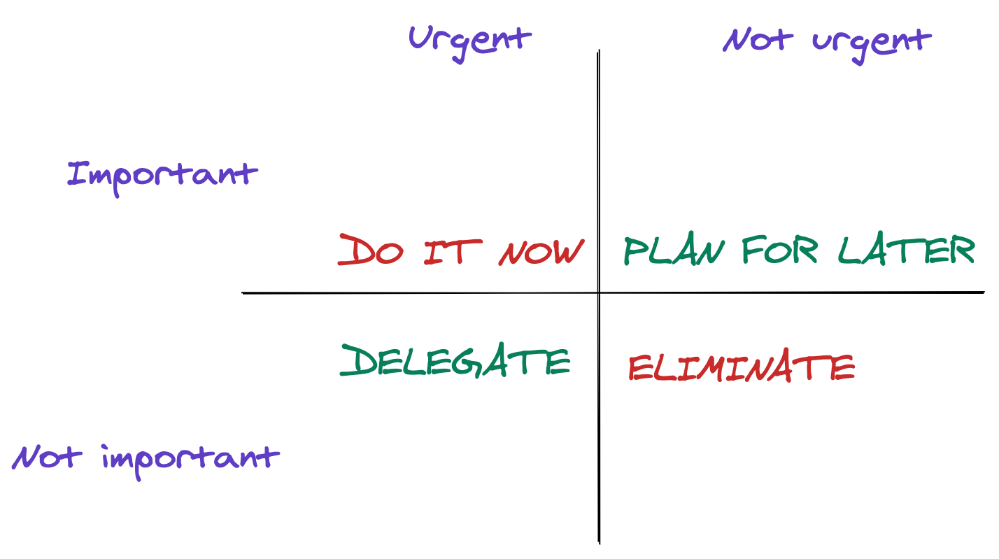

This is part 3 of the [series](../tags/transition). In the previous [post](../learn-what-not-to-do), I wrote about the challenges with time management and how I learned to get better at it.

> Timing is everything! Once I learned to identify the important things, it got better over time to decide what not to do.

In this post, I will talk about one of the time management strategies called the [Eisenhower Method](https://en.wikipedia.org/wiki/Time_management) and how it helps me in my day to day work as an Engineering Manager.

## Interruption driven development

I work as an Engineering Manager at Anaconda. Being in a leadership position means I am constantly interrupted with various things.

## How to manage time and tasks

<iframe width="560" height="315" src="https://www.youtube.com/embed/fCPvL2AVLAY" title="YouTube video player" frameborder="0" allow="accelerometer; autoplay; clipboard-write; encrypted-media; gyroscope; picture-in-picture" allowfullscreen></iframe>

## Time management best practices

<iframe width="560" height="315" src="https://www.youtube.com/embed/9aeiEvglfJk" title="YouTube video player" frameborder="0" allow="accelerometer; autoplay; clipboard-write; encrypted-media; gyroscope; picture-in-picture" allowfullscreen></iframe>